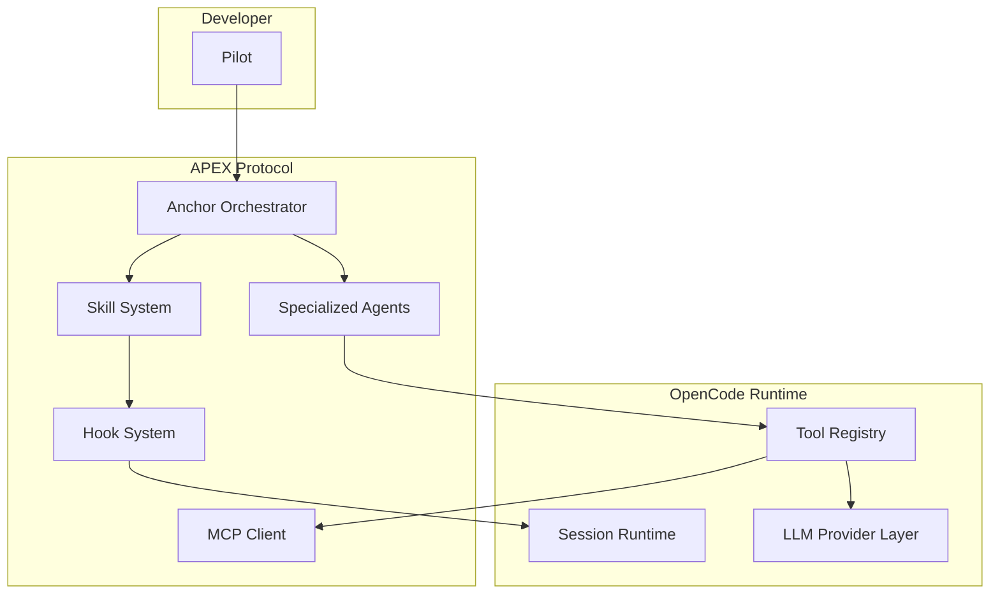
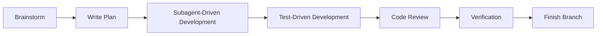

# APEX Protocol

**[English](README.md)** | **[Português](README.pt.md)**

[](LICENSE)
[](https://bun.sh)
[](https://www.typescriptlang.org)

APEX Protocol is an AI-assisted development framework built on top of OpenCode. It combines a local roster of specialized agents, a skill system, session hooks, and MCP integrations into a single protocol for shipping software with high precision and minimal overhead.

The framework treats the developer as the pilot and each specialized agent as a tactical unit. APEX does not replace engineering judgment; it amplifies it through structured delegation, adversarial planning, and rigorous verification gates.

Agents, commands, and skills are defined locally in this repository under `.apex/` and `packages/opencode/assets/skills/`.

## What APEX Provides

| Capability | What It Does |
|------------|--------------|
| **Agent Roster** | 23 specialized agents for orchestration, planning, execution, research, creative work, and specialist routing. |
| **Skill System** | 33 skills that activate automatically or on demand to enforce workflows such as TDD, debugging, PR lifecycle, and adversarial planning. |
| **Hook System** | Platform-aware session hooks that inject context, guard tool usage, manage continuations, and filter prompts. |
| **MCP Integration** | Built-in Model Context Protocol client with default servers for search, memory, LSP, documentation, and code exploration. |
| **Multi-Platform Runtime** | Runs on Claude Code, Codex CLI, Cursor, and OpenCode with platform-specific hook configurations. |

## Installation

Prerequisites: [Bun 1.3+](https://bun.sh) or Node.js 18+.

**Windows users:** some native dependencies require Visual Studio Build Tools with the "Desktop development with C++" workload. Download it [here](https://aka.ms/vs/17/release/vs_BuildTools.exe) if `bun install` fails.

**Recommended installation directory:** `~/.config/apex` (Linux/macOS) or `%USERPROFILE%\.config\apex` (Windows).  
**Do not clone into your Desktop or Documents folders** — APEX is a development tool, not a user document, and keeping it under `.config` keeps your home directory tidy and avoids accidental edits.

### Manual install

```bash
# Create the config directory if it doesn't exist
mkdir -p ~/.config

# Clone the APEX repository into the recommended location
git clone <your-apex-repo-url>.git ~/.config/apex
cd ~/.config/apex

# Install dependencies
bun install

# Start the terminal UI
bun run dev
```

### One-line install (npm)

If you have Node.js/npm installed, you can use the official installer package:

```bash
npm install -g @apex-code/apex
apex setup
```

This will automatically clone the repository into `~/.config/apex`, install dependencies, and add the `apex` command to your PATH.

The `install` script at the repository root downloads the OpenCode CLI binary; to install the APEX source itself, run `bun install` from the repository root.

### Uninstall

```bash
apex uninstall       # Remove APEX from ~/.config/apex
npm uninstall -g @apex-code/apex   # Remove the CLI
```

Common development commands:

```bash
bun run dev:desktop      # Start the desktop application
bun run dev:web          # Start the web application
bun run dev:console      # Start the developer console
bun run lint             # Run oxlint
bun run typecheck        # Run type checks across packages
```

## Architecture



### Package Map

| Package | Purpose | Technology |
|---------|---------|------------|
| `packages/opencode` | Core agent system, CLI entry point, session management, tool execution, plugin runtime, MCP client. | TypeScript, Bun |
| `packages/core` | Effect-TS services, SQLite database, session runner, system context, PTY handling. | Effect-TS, Drizzle |
| `packages/tui` | Terminal UI with editor, prompt display, keymaps, dialogs, and toasts. | OpenTUI, SolidJS |
| `packages/desktop` | Electron desktop application. | Electron |
| `packages/app` | SolidJS web application for project and provider management. | SolidJS, Tailwind |
| `packages/console` | Multi-tenant SaaS console with billing and resource management. | Hono, JSX-email |
| `packages/sdk/js` | JavaScript SDK for extensions and client generation. | TypeScript |
| `packages/plugin` | Plugin system and v2 Effect integration. | Effect-TS |
| `packages/llm` | LLM provider integrations and protocol adapters. | AI SDK |
| `packages/server` | Backend HTTP server. | Hono |
| `packages/web` | Public documentation website. | Astro |
| `packages/enterprise` | Enterprise features, auth, and billing. | OpenAuth.js, SST |
| `packages/ui` | Shared UI components and hooks. | SolidJS |
| `packages/storybook` | Component documentation and testing. | Storybook |

## Agents

APEX ships with a roster of specialized agents exposed in the agent selection UI. Each agent has a single responsibility and a defined handoff pattern. Agent instructions are stored in `packages/opencode/assets/agents/agents/`.

### Orchestration and Planning

| Agent | Codename | Function |
|-------|----------|----------|
| `apex-cooper` | Cooper — Lead Pilot | Powerful AI orchestrator. Plans and coordinates the entire workflow. |
| `apex-anchor` | Anchor — General Core | Master orchestrator. Coordinates every agent, task, and verification until the plan is complete. |
| `apex-northstar` | Northstar — Strategy Mapper | Strategy mapper and planning agent. |
| `apex-pathfinder` | Pathfinder — Plan Engine | Planning consultant. Gathers information, defines scope, and produces executable plans. |
| `apex-ion` | Ion — Scope Planner | Scope planning and definition. |
| `apex-scorch` | Scorch — Design Planner | Design scoping and planning. |
| `apex-stryder` | Stryder — Plan Executor | Plan execution and coordination. |
| `apex-viper` | Viper — Adversarial Reviewer | Adversarial plan review. |

### Execution and Task Workers

| Agent | Codename | Function |
|-------|----------|----------|
| `apex-tone` | Tone — Task Worker | Orchestrates work via task() calls. |
| `apex-dash` | Dash — Work Runner | Work coordination and running. |
| `apex-foundry` | Foundry — Build Core | Build specialist. Implements features, fixes bugs, and refactors code with surgical precision. |
| `apex-a-wall` | A-Wall — Guard Worker | Guard and protective worker. |
| `apex-reaper` | Reaper — Bug Hunter | Bug hunting and quality guarding. |

### Research and Context

| Agent | Codename | Function |
|-------|----------|----------|
| `apex-data-knife` | Data Knife — Code Librarian | Code reading and library research. |
| `apex-grapple` | Grapple — Context Scout | Context exploration and scouting. |
| `apex-prowler` | Prowler — Web Digger | Deep web research and digging. |
| `apex-smart-pistol` | Smart Pistol — Data Analyst | Data analysis and number crunching. |

### Creative and Media

| Agent | Codename | Function |
|-------|----------|----------|
| `apex-holo-pilot` | Holo Pilot — Picture Reader | Image reading and analysis. |
| `apex-holo-video` | Holo-Video — Video Maker | Video creation and making. |
| `apex-mrvn-docs` | MRVN — Doc Writer | Document writing and creation. |
| `apex-mrvn-slides` | MRVN — Slide Maker | Slide creation and making. |

### Specialist Routing

| Agent | Codename | Function |
|-------|----------|----------|
| `apex-imc` | IMC — Specialist Dispatcher | Specialist routing and dispatch. |
| `apex-stim` | Stim — Change Maker | Change catalyst and transformation execution. |

Agent definitions live in `packages/opencode/assets/agents/agents/` and `.apex/agent/`.

## Skills

Skills are executable workflow modules. They activate automatically when trigger phrases are detected or on explicit invocation via `skill(name="...")` or `/skill-name`.

### Work Loops

| Skill | Description | Invocation |
|-------|-------------|------------|
| `ralph-loop` | Self-referential loop that continues until the task is complete. | `/ralph-loop` |
| `ulw-loop` | Ultrawork loop with systematic decomposition and manual QA checkpoints. | `/ulw-loop` |
| `hyperplan` | Adversarial multi-agent planning with five hostile critics. | `/hyperplan` |

### Development Process

| Skill | Description | Invocation |
|-------|-------------|------------|
| `brainstorming` | Collaborative design with socratic questioning before any code is written. | Automatic on creative work |
| `writing-plans` | Creates detailed implementation plans with bite-sized tasks. | Automatic on multi-step work |
| `executing-plans` | Executes written plans in a separate session with review checkpoints. | `skill(name="executing-plans")` |
| `subagent-driven-development` | Dispatches a fresh subagent per task with two-stage review. | Automatic on complex tasks |
| `test-driven-development` | Enforces RED-GREEN-REFACTOR before production code. | Automatic on implementation |
| `systematic-debugging` | Four-phase debugging process: reproduce, isolate, fix, verify. | Automatic on bugs |
| `verification-before-completion` | Requires evidence before declaring any work complete. | Automatic before completion |

### Collaboration and Review

| Skill | Description | Invocation |
|-------|-------------|------------|
| `requesting-code-review` | Pre-review checklist before any PR. | Automatic before merge |
| `receiving-code-review` | Processes review feedback with technical rigor. | Automatic after review |
| `work-with-pr` | Full PR lifecycle: implementation, QA, PR creation, CI verification, merge, cleanup. | `/work-with-pr` |
| `github-triage` | Read-only GitHub triage for issues and PRs with evidence-backed reports. | `/github-triage` |
| `pre-publish-review` | 16-agent release gate before publishing to npm. | `/pre-publish-review` |
| `review-work` | Post-implementation review with five parallel agents. | `/review-work` |

### Git and Workspace

| Skill | Description | Invocation |
|-------|-------------|------------|
| `using-git-worktrees` | Isolates feature work via git worktrees. | Automatic on new feature |
| `finishing-a-development-branch` | Verifies tests and presents merge or PR options. | Automatic at branch end |
| `git-master` | Atomic commits, rebase, squash, and history investigation. | `/git-master` |

### Team and Agents

| Skill | Description | Invocation |
|-------|-------------|------------|
| `teammode` | Runs a named team of cooperating Codex threads with durable state. | `/teammode` |
| `dispatching-parallel-agents` | Dispatches agents for independent concurrent tasks. | Automatic on parallel work |

### APEX YAGNI Suite

| Skill | Description | Invocation |
|-------|-------------|------------|
| `apex-yagni` | Forces the laziest working solution. Modes: off, lite, full, ultra. | `/apex-yagni` |
| `apex-yagni-review` | Code review focused on deleting over-engineering. | `/apex-yagni-review` |
| `apex-yagni-audit` | Whole-repo audit for bloat and reinvention. | `/apex-yagni-audit` |
| `apex-yagni-debt` | Harvests `apex-yagni:` comments into a debt ledger. | `/apex-yagni-debt` |
| `apex-yagni-gain` | Displays measured impact scoreboard. | `/apex-yagni-gain` |
| `apex-yagni-help` | Quick reference for all YAGNI modes and commands. | `/apex-yagni-help` |

### APEX-Specific Skills

| Skill | Description | Invocation |
|-------|-------------|------------|
| `composio-integration` | Integrates external systems via Composio. | Automatic on external integration |
| `multimodal-delivery` | Produces non-text deliverables such as slides, images, and video. | Automatic on media deliverables |
| `orchestrator-routing` | Decides which APEX specialist should handle a request. | Automatic on routing decisions |

### Meta Skills

| Skill | Description | Invocation |
|-------|-------------|------------|
| `using-apex` | Establishes how to find and invoke skills. | Automatic on session start |
| `writing-skills` | Creates and verifies new skills. | `/writing-skills` |
| `start-work` | Executes a Prometheus work plan. | `/start-work` |

### Development Tools

| Skill | Description | Invocation |
|-------|-------------|------------|
| `programming` | Python, Rust, TypeScript, and Go development workflow. | `/programming` |
| `frontend` | Frontend, UI, UX, and design work. | `/frontend` |
| `debugging` | Runtime debugging across languages and binaries. | `/debugging` |
| `ast-grep` | AST-aware code search and rewrite. | `/ast-grep` |
| `lsp-setup` | Configures language servers. | `/lsp-setup` |
| `ultimate-browsing` | Escalation for blocked or hard-to-reach web content. | `/ultimate-browsing` |
| `remove-ai-slops` | Removes AI-generated code smells from branch changes. | `/remove-ai-slops` |

Skill definitions live in `packages/opencode/assets/skills/`.

## Commands

Commands are invoked via slash in the chat interface.

### Built-in Commands

| Command | Description |
|---------|-------------|
| `/init` | Guided AGENTS.md setup. |
| `/review` | Review changes (uncommitted, commit, branch, or PR). |
| `/swarm` | Spawn a swarm of subagents for large tasks in parallel. |
| `/swarm-loop` | Continuous swarm loop until goal completion. |

### APEX Plugin Commands

| Command | Description |
|---------|-------------|
| `/hyperplan` | Run adversarial multi-agent planning. |
| `/ralph-loop` | Start Ralph self-referential development loop. |
| `/ulw-loop` | Start ultrawork self-development loop. |

### OpenCode-Local Commands

| Command | Description |
|---------|-------------|
| `/ai-deps` | Bump AI SDK dependencies minor/patch versions. |
| `/changelog` | Create UPCOMING_CHANGELOG.md from structured input. |
| `/commit` | Git commit and push with semantic prefix validation. |
| `/issues` | Find GitHub issues matching a query. |
| `/learn` | Extract non-obvious session learnings to AGENTS.md. |
| `/rmslop` | Remove AI-generated code slop from branch diff. |
| `/spellcheck` | Spellcheck all changed markdown files. |
| `/translate` | Translate changed English docs to other locales. |

### Skill Commands

All 33 skills listed above are invocable as commands via `/skill-name` or `skill(name="...")`. Key skill commands include:

| Command | Description |
|---------|-------------|
| `/start-work` | Execute a Prometheus work plan. |
| `/review-work` | Run post-implementation review with five agents. |
| `/work-with-pr` | Full PR lifecycle in an isolated worktree. |
| `/github-triage` | Read-only GitHub triage. |
| `/pre-publish-review` | 16-agent pre-publish release gate. |
| `/security-research` | Team-mode security audit. |
| `/remove-ai-slops` | Remove AI code smells. |
| `/git-master` | Atomic commits, rebase, squash, blame, bisect. |
| `/programming` | Python/Rust/TypeScript/Go development. |
| `/frontend` | Frontend, UI, UX, and design work. |
| `/debugging` | Runtime debugging. |
| `/ast-grep` | AST-aware code search and rewrite. |
| `/lsp-setup` | Configure language servers. |
| `/ultraresearch` | Maximum-saturation research. |
| `/ultimate-browsing` | Escalation for blocked web access. |
| `/visual-qa` | Visual QA for web and terminal UIs. |
| `/teammode` | Run a named team of Codex threads. |
| `/apex-yagni` | Force the laziest working solution. |
| `/apex-yagni-review` | Review for over-engineering. |
| `/apex-yagni-audit` | Whole-repo audit for bloat. |
| `/writing-skills` | Create and verify new skills. |

### Meta

| Command | Description |
|---------|-------------|
| `/init-deep` | Initialize hierarchical AGENTS.md knowledge base. |
| `/learn` | Extract learnings into AGENTS.md files. |
| `/refactor` | Intelligent refactoring with LSP and AST-grep analysis. |
| `/spellcheck` | Spellchecks markdown file changes. |
| `/translate` | Translates English to other languages. |
| `/issues` | Finds issues on GitHub. |
| `/deadpan-switch` | Toggles deadpan mode on or off. |

### Hookify

| Command | Description |
|---------|-------------|
| `/hookify` | Creates hooks to prevent unwanted behaviors. |
| `/hookify-list` | Lists configured hookify rules. |
| `/hookify-configure` | Enables or disables hookify rules. |
| `/hookify-help` | Shows hookify help. |

### Ponytail

| Command | Description |
|---------|-------------|
| `/ponytail` | Set ponytail intensity level. |
| `/ponytail-audit` | Audit the repo for over-engineering. |
| `/ponytail-debt` | Harvest comments into a debt ledger. |
| `/ponytail-gain` | Show ponytail impact scoreboard. |
| `/ponytail-help` | Quick reference for ponytail levels. |
| `/ponytail-review` | Review changes for over-engineering. |

## Hooks

Hooks intercept session lifecycle events, tool execution, message transforms, continuations, and skill activation. They are platform-aware: separate configurations exist for Claude Code, Codex, and Cursor.

| Hook | Event | Description |
|------|-------|-------------|
| `session-start` | SessionStart | Injects the `using-apex` skill context on session start, resume, and clear. |
| `session-start-codex` | SessionStart | Codex-specific variant of the session start hook. |
| `apex-yagni-session-start` | SessionStart | Injects the active YAGNI ruleset based on current mode. |
| `apex-yagni-prompt-filter` | UserPromptSubmit | Detects `/apex-yagni*` commands and updates the active mode. |

Hook configurations live in `hooks/hooks.json`, `hooks/hooks-codex.json`, and `hooks/hooks-cursor.json`. Superpowers hooks mirror this structure under `superpowers/hooks/`.

## MCP Servers

APEX includes an MCP client that connects to local and remote servers. Default servers are defined in `packages/opencode/src/mcp/defaults.ts`.

| Server | Transport | Purpose |
|--------|-----------|---------|
| `ast_grep` | Local stdio | AST-based code search and structural rewriting. |
| `basic_memory` | Local stdio | Persistent memory and knowledge base. |
| `context7` | Remote HTTP | Context7 documentation search. |
| `grep_app` | Remote HTTP | grep.app code search across public repositories. |
| `lsp` | Local stdio | Language Server Protocol for TypeScript. |
| `serena` | Local stdio | Serena code exploration and symbol navigation. |
| `websearch` | Remote HTTP | Web search capability. |

### MCP Client Components

| Component | Purpose | Location |
|-----------|---------|----------|
| `MCP Service` | Manages connections, transports, and connection lifecycle. | `packages/opencode/src/mcp/index.ts` |
| `MCP Catalog` | Converts tool definitions and handles prompts/resources. | `packages/opencode/src/mcp/catalog.ts` |
| `MCP Auth` | Token storage and refresh with file-based locking. | `packages/opencode/src/mcp/auth.ts` |
| `OAuth Provider` | OAuth 2.0 flow for MCP servers. | `packages/opencode/src/mcp/oauth-provider.ts` |
| `OAuth Callback` | Redirect handling server for OAuth flows. | `packages/opencode/src/mcp/oauth-callback.ts` |

## UI Components and Hooks

| Component | Purpose | Location |
|-----------|---------|----------|
| `useFilteredList` | Filtered list with fuzzy search, grouping, and keyboard navigation. | `packages/ui/src/hooks/use-filtered-list.tsx` |
| `createAutoScroll` | Auto-scroll behavior for chat and output surfaces. | `packages/ui/src/hooks/create-auto-scroll.tsx` |
| `useProviders` | Provider management and project-scoped configuration. | `packages/app/src/hooks/use-providers.ts` |

## Infrastructure Modules

| Module | Purpose | Location |
|--------|---------|----------|
| `stats` | Statistics collection and reporting. | `infra/stats.ts` |
| `stage` | Environment and staging configuration. | `infra/stage.ts` |
| `secret` | Secrets management. | `infra/secret.ts` |
| `monitoring` | Observability and monitoring. | `infra/monitoring.ts` |
| `lake` | Data lake utilities. | `infra/lake.ts` |
| `enterprise` | Enterprise-specific functionality. | `infra/enterprise.ts` |
| `console` | Console infrastructure. | `infra/console.ts` |
| `app` | App infrastructure. | `infra/app.ts` |

## Workflow



1. **Brainstorm** clarifies intent before any code is written.
2. **Write Plan** breaks the work into atomic, verifiable tasks.
3. **Subagent-Driven Development** dispatches specialists per task.
4. **Test-Driven Development** requires a failing test before production code.
5. **Code Review** validates each change against project standards.
6. **Verification** runs tests, type checks, and real behavior checks.
7. **Finish Branch** integrates the work via merge or PR.

## Security

| Feature | Description |
|---------|-------------|
| Agent permissions | Each agent operates within a scoped permission model. |
| Tool guards | Hooks validate tool inputs and outputs before execution. |
| Audit trail | Session history and tool settlements are durably persisted. |
| Security research | `/security-research` runs a team-mode audit with exploitability proof. |
| Secret management | Enterprise infrastructure provides scoped secret handling. |

## Contributing

Contributions are welcome. Follow the conventions in `AGENTS.md`:

- Branch names: short, hyphenated, no type prefixes. Example: `session-recovery`.
- Commits and PR titles: `type(scope): summary`. Valid types: `feat`, `fix`, `docs`, `chore`, `refactor`, `test`.
- Type check from the affected package directory, not the root.
- Avoid mocks in tests; test actual implementation.

To contribute:

1. Fork the repository.
2. Create a branch for your change.
3. Commit with a conventional message.
4. Open a pull request.

## License

APEX Protocol is released under the [MIT License](LICENSE).
