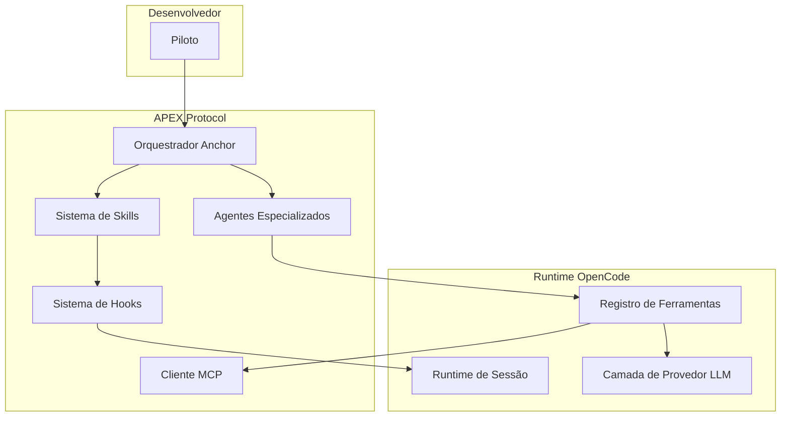
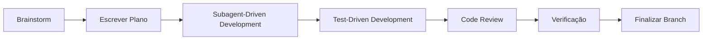

# APEX Protocol

**[English](README.md)** | **[Português](README.pt.md)**

[](LICENSE)
[](https://bun.sh)
[](https://www.typescriptlang.org)

APEX Protocol é um framework de desenvolvimento assistido por IA construído sobre o OpenCode. Ele combina um time local de agentes especializados, um sistema de skills, hooks de sessão e integrações MCP em um único protocolo para entregar software com alta precisão e o mínimo de sobrecarga.

O framework trata o desenvolvedor como o piloto e cada agente especializado como uma unidade tática. O APEX não substitui o julgamento de engenharia; ele o amplifica por meio de delegação estruturada, planejamento adversarial e gates rigorosos de verificação.

Agentes, comandos e skills são definidos localmente neste repositório em `.apex/` e `packages/opencode/assets/skills/`.

## O que o APEX oferece

| Capacidade | O que faz |
|------------|-----------|
| **Time de agentes** | 23 agentes especializados para orquestração, planejamento, execução, pesquisa, trabalho criativo e roteamento especialista. |
| **Sistema de skills** | 33 skills que ativam automaticamente ou sob demanda para impor workflows como TDD, debugging, ciclo de PR e planejamento adversarial. |
| **Sistema de hooks** | Hooks de sessão conscientes da plataforma que injetam contexto, guardam o uso de ferramentas, gerenciam continuações e filtram prompts. |
| **Integração MCP** | Cliente Model Context Protocol embutido com servidores padrão para busca, memória, LSP, documentação e exploração de código. |
| **Runtime multiplataforma** | Roda em Claude Code, Codex CLI, Cursor e OpenCode, com configurações de hook específicas por plataforma. |

## Como instalar

Pré-requisitos: [Bun 1.3+](https://bun.sh) ou Node.js 18+.

**Usuários Windows:** algumas dependências nativas exigem Visual Studio Build Tools com a workload "Desktop development with C++". Baixe [aqui](https://aka.ms/vs/17/release/vs_BuildTools.exe) se o `bun install` falhar.

**Diretório de instalação recomendado:** `~/.config/apex` (Linux/macOS) ou `%USERPROFILE%\.config\apex` (Windows).  
**Não clone na Área de Trabalho ou em Documentos** — o APEX é uma ferramenta de desenvolvimento, não um documento do usuário. Mantê-lo em `.config` deixa seu diretório home organizado e evita edições acidentais.

### Instalação manual

```bash
# Crie o diretório de config caso não exista
mkdir -p ~/.config

# Clone o repositório APEX no local recomendado
git clone <url-do-repositorio-apex>.git ~/.config/apex
cd ~/.config/apex

# Instale as dependências
bun install

# Inicie a interface de terminal
bun run dev
```

### Instalação one-line (npm)

Se você tem Node.js/npm instalado, pode usar o pacote instalador oficial:

```bash
npm install -g @apex-code/apex
apex setup
```

Isso vai clonar o repositório automaticamente em `~/.config/apex`, instalar as dependências e adicionar o comando `apex` ao seu PATH.

O script `install` na raiz do repositório baixa o binário da CLI do OpenCode; para instalar o código-fonte do APEX em si, execute `bun install` a partir da raiz do repositório.

Comandos comuns de desenvolvimento:

```bash
bun run dev:desktop      # Inicia a aplicação desktop
bun run dev:web          # Inicia a aplicação web
bun run dev:console      # Inicia o console de desenvolvedor
bun run lint             # Executa o oxlint
bun run typecheck        # Verifica tipos em todos os pacotes
```

## Arquitetura



### Mapa de pacotes

| Pacote | Propósito | Tecnologia |
|--------|-----------|------------|
| `packages/opencode` | Sistema de agentes principal, ponto de entrada da CLI, gerenciamento de sessão, execução de ferramentas, runtime de plugins, cliente MCP. | TypeScript, Bun |
| `packages/core` | Serviços Effect-TS, banco SQLite, executor de sessão, contexto do sistema, manipulação de PTY. | Effect-TS, Drizzle |
| `packages/tui` | Interface de terminal com editor, exibição de prompt, keymaps, diálogos e toasts. | OpenTUI, SolidJS |
| `packages/desktop` | Aplicação desktop baseada em Electron. | Electron |
| `packages/app` | Aplicação web SolidJS para gerenciamento de projetos e provedores. | SolidJS, Tailwind |
| `packages/console` | Console SaaS multi-tenant com cobrança e gerenciamento de recursos. | Hono, JSX-email |
| `packages/sdk/js` | SDK JavaScript para extensões e geração de clientes. | TypeScript |
| `packages/plugin` | Sistema de plugins e integração v2 com Effect. | Effect-TS |
| `packages/llm` | Integrações com provedores LLM e adaptadores de protocolo. | AI SDK |
| `packages/server` | Servidor HTTP backend. | Hono |
| `packages/web` | Site público de documentação. | Astro |
| `packages/enterprise` | Recursos enterprise, autenticação e cobrança. | OpenAuth.js, SST |
| `packages/ui` | Componentes de UI compartilhados e hooks. | SolidJS |
| `packages/storybook` | Documentação e teste de componentes. | Storybook |

## Agentes

O APEX vem com um time de agentes especializados expostos na interface de seleção de agentes. Cada agente tem uma única responsabilidade e um padrão definido de handoff. As instruções dos agentes ficam em `packages/opencode/assets/agents/agents/`.

### Orquestração e planejamento

| Agente | Codinome | Função |
|--------|----------|--------|
| `apex-cooper` | Cooper — Lead Pilot | Orquestrador de IA poderoso. Planeja e coordena todo o workflow. |
| `apex-anchor` | Anchor — General Core | Orquestrador principal. Coordena todos os agentes, tarefas e verificações até o plano estar completo. |
| `apex-northstar` | Northstar — Strategy Mapper | Mapeador de estratégia e agente de planejamento. |
| `apex-pathfinder` | Pathfinder — Plan Engine | Consultor de planejamento. Reúne informações, define escopo e produz planos executáveis. |
| `apex-ion` | Ion — Scope Planner | Planejamento e definição de escopo. |
| `apex-scorch` | Scorch — Design Planner | Definição e planejamento de design. |
| `apex-stryder` | Stryder — Plan Executor | Execução e coordenação de planos. |
| `apex-viper` | Viper — Adversarial Reviewer | Revisão adversarial de planos. |

### Execução e workers de tarefa

| Agente | Codinome | Função |
|--------|----------|--------|
| `apex-tone` | Tone — Task Worker | Orquestra trabalho via chamadas task(). |
| `apex-dash` | Dash — Work Runner | Coordenação e execução de trabalho. |
| `apex-foundry` | Foundry — Build Core | Especialista em build. Implementa features, corrige bugs e refatora código com precisão cirúrgica. |
| `apex-a-wall` | A-Wall — Guard Worker | Agente de proteção e guarda. |
| `apex-reaper` | Reaper — Bug Hunter | Caça a bugs e guarda de qualidade. |

### Pesquisa e contexto

| Agente | Codinome | Função |
|--------|----------|--------|
| `apex-data-knife` | Data Knife — Code Librarian | Leitura de código e pesquisa de bibliotecas. |
| `apex-grapple` | Grapple — Context Scout | Exploração e mapeamento de contexto. |
| `apex-prowler` | Prowler — Web Digger | Pesquisa profunda na web. |
| `apex-smart-pistol` | Smart Pistol — Data Analyst | Análise de dados e números. |

### Criativo e mídia

| Agente | Codinome | Função |
|--------|----------|--------|
| `apex-holo-pilot` | Holo Pilot — Picture Reader | Leitura e análise de imagens. |
| `apex-holo-video` | Holo-Video — Video Maker | Criação e produção de vídeo. |
| `apex-mrvn-docs` | MRVN — Doc Writer | Escrita e criação de documentos. |
| `apex-mrvn-slides` | MRVN — Slide Maker | Criação e produção de slides. |

### Roteamento especialista

| Agente | Codinome | Função |
|--------|----------|--------|
| `apex-imc` | IMC — Specialist Dispatcher | Roteamento e despacho de especialistas. |
| `apex-stim` | Stim — Change Maker | Catalisador de mudança e execução de transformação. |

As definições de agentes ficam em `packages/opencode/assets/agents/agents/` e `.apex/agent/`.

## Skills

Skills são módulos de workflow executáveis. Elas ativam automaticamente quando frases-gatilho são detectadas ou sob invocação explícita via `skill(name="...")` ou `/skill-name`.

### Loops de trabalho

| Skill | Descrição | Invocação |
|-------|-----------|-----------|
| `ralph-loop` | Loop auto-referencial que continua até a tarefa estar completa. | `/ralph-loop` |
| `ulw-loop` | Loop ultrawork com decomposição sistemática e checkpoints de QA manual. | `/ulw-loop` |
| `hyperplan` | Planejamento adversarial multi-agente com cinco críticos hostis. | `/hyperplan` |

### Processo de desenvolvimento

| Skill | Descrição | Invocação |
|-------|-----------|-----------|
| `brainstorming` | Design colaborativo com questionamento socrático antes de qualquer código. | Automático em trabalho criativo |
| `writing-plans` | Cria planos detalhados de implementação com tarefas pequenas. | Automático em trabalho multi-etapa |
| `executing-plans` | Executa planos escritos em sessão separada com checkpoints de revisão. | `skill(name="executing-plans")` |
| `subagent-driven-development` | Despacha um subagente novo por tarefa com revisão em dois estágios. | Automático em tarefas complexas |
| `test-driven-development` | Impõe RED-GREEN-REFACTOR antes do código de produção. | Automático em implementação |
| `systematic-debugging` | Processo de debugging em quatro fases: reproduzir, isolar, corrigir, verificar. | Automático em bugs |
| `verification-before-completion` | Exige evidências antes de declarar qualquer trabalho completo. | Automático antes da conclusão |

### Colaboração e revisão

| Skill | Descrição | Invocação |
|-------|-----------|-----------|
| `requesting-code-review` | Checklist pré-revisão antes de qualquer PR. | Automático antes do merge |
| `receiving-code-review` | Processa feedback de revisão com rigor técnico. | Automático após revisão |
| `work-with-pr` | Ciclo completo de PR: implementação, QA, criação de PR, verificação de CI, merge, limpeza. | `/work-with-pr` |
| `github-triage` | Triagem read-only de issues e PRs do GitHub com relatórios baseados em evidências. | `/github-triage` |
| `pre-publish-review` | Gate de release com 16 agentes antes de publicar no npm. | `/pre-publish-review` |
| `review-work` | Revisão pós-implementação com cinco agentes paralelos. | `/review-work` |

### Git e workspace

| Skill | Descrição | Invocação |
|-------|-----------|-----------|
| `using-git-worktrees` | Isola o trabalho de uma feature via git worktrees. | Automático em nova feature |
| `finishing-a-development-branch` | Verifica testes e apresenta opções de merge ou PR. | Automático no fim de branch |
| `git-master` | Commits atômicos, rebase, squash e investigação de histórico. | `/git-master` |

### Time e agentes

| Skill | Descrição | Invocação |
|-------|-----------|-----------|
| `teammode` | Executa uma equipe nomeada de threads Codex cooperando com estado durável. | `/teammode` |
| `dispatching-parallel-agents` | Despacha agentes para tarefas independentes e concorrentes. | Automático em trabalho paralelo |

### Suite APEX YAGNI

| Skill | Descrição | Invocação |
|-------|-----------|-----------|
| `apex-yagni` | Força a solução mais preguiçosa que funciona. Modos: off, lite, full, ultra. | `/apex-yagni` |
| `apex-yagni-review` | Revisão de código focada em deletar over-engineering. | `/apex-yagni-review` |
| `apex-yagni-audit` | Auditoria completa do repositório para bloat e reinvenção. | `/apex-yagni-audit` |
| `apex-yagni-debt` | Coleta comentários `apex-yagni:` em um ledger de dívida. | `/apex-yagni-debt` |
| `apex-yagni-gain` | Exibe painel de impacto medido. | `/apex-yagni-gain` |
| `apex-yagni-help` | Referência rápida para todos os modos e comandos YAGNI. | `/apex-yagni-help` |

### Skills específicas do APEX

| Skill | Descrição | Invocação |
|-------|-----------|-----------|
| `composio-integration` | Integra sistemas externos via Composio. | Automático em integração externa |
| `multimodal-delivery` | Produz entregáveis não-textuais como slides, imagens e vídeo. | Automático em entregáveis de mídia |
| `orchestrator-routing` | Decide qual especialista APEX deve lidar com uma solicitação. | Automático em decisões de roteamento |

### Skills meta

| Skill | Descrição | Invocação |
|-------|-----------|-----------|
| `using-apex` | Estabelece como encontrar e invocar skills. | Automático no início da sessão |
| `writing-skills` | Cria e verifica novas skills. | `/writing-skills` |
| `start-work` | Executa um plano de trabalho Prometheus. | `/start-work` |

### Ferramentas de desenvolvimento

| Skill | Descrição | Invocação |
|-------|-----------|-----------|
| `programming` | Workflow de desenvolvimento Python, Rust, TypeScript e Go. | `/programming` |
| `frontend` | Trabalho de frontend, UI, UX e design. | `/frontend` |
| `debugging` | Debugging runtime em várias linguagens e binários. | `/debugging` |
| `ast-grep` | Busca e reescrita de código baseada em AST. | `/ast-grep` |
| `lsp-setup` | Configura language servers. | `/lsp-setup` |
| `ultimate-browsing` | Escalação para conteúdo web bloqueado ou de difícil acesso. | `/ultimate-browsing` |
| `remove-ai-slops` | Remove odores de código gerado por IA das mudanças de branch. | `/remove-ai-slops` |

As definições de skills ficam em `packages/opencode/assets/skills/`.

## Comandos

Comandos são invocados via barra na interface de chat.

### Comandos embutidos

| Comando | Descrição |
|---------|-----------|
| `/init` | Configuração guiada do AGENTS.md. |
| `/review` | Revisa mudanças (não commitadas, commit, branch ou PR). |
| `/swarm` | Gera um enxame de subagentes para tarefas grandes em paralelo. |
| `/swarm-loop` | Loop contínuo de enxame até a conclusão do objetivo. |

### Comandos do plugin APEX

| Comando | Descrição |
|---------|-----------|
| `/hyperplan` | Executa planejamento adversarial multi-agente. |
| `/ralph-loop` | Inicia o loop de desenvolvimento auto-referencial Ralph. |
| `/ulw-loop` | Inicia o loop de desenvolvimento ultrawork. |

### Comandos locais do OpenCode

| Comando | Descrição |
|---------|-----------|
| `/ai-deps` | Atualiza dependências do AI SDK (minor/patch). |
| `/changelog` | Cria UPCOMING_CHANGELOG.md a partir de input estruturado. |
| `/commit` | Faz commit e push com validação de prefixo semântico. |
| `/issues` | Encontra issues no GitHub correspondendo a uma query. |
| `/learn` | Extrai aprendizados não óbvios da sessão para AGENTS.md. |
| `/rmslop` | Remove AI slop gerado por IA do diff de branch. |
| `/spellcheck` | Verifica ortografia de todos os arquivos markdown alterados. |
| `/translate` | Traduz documentos em inglês alterados para outros idiomas. |

### Comandos de skills

Todas as 33 skills listadas acima são invocáveis como comandos via `/skill-name` ou `skill(name="...")`. Os principais comandos de skills incluem:

| Comando | Descrição |
|---------|-----------|
| `/start-work` | Executa um plano de trabalho Prometheus. |
| `/review-work` | Executa revisão pós-implementação com cinco agentes. |
| `/work-with-pr` | Ciclo completo de PR em worktree isolado. |
| `/github-triage` | Triagem read-only do GitHub. |
| `/pre-publish-review` | Gate de pré-publicação com 16 agentes. |
| `/security-research` | Auditoria de segurança em modo equipe. |
| `/remove-ai-slops` | Remove odores de código de IA. |
| `/git-master` | Commits atômicos, rebase, squash, blame, bisect. |
| `/programming` | Desenvolvimento Python/Rust/TypeScript/Go. |
| `/frontend` | Trabalho de frontend, UI, UX e design. |
| `/debugging` | Debugging runtime. |
| `/ast-grep` | Busca e reescrita de código baseada em AST. |
| `/lsp-setup` | Configura language servers. |
| `/ultraresearch` | Pesquisa de saturação máxima. |
| `/ultimate-browsing` | Escalação para conteúdo web bloqueado. |
| `/visual-qa` | QA visual para UIs web e de terminal. |
| `/teammode` | Executa uma equipe nomeada de threads Codex. |
| `/apex-yagni` | Força a solução mais preguiçosa que funciona. |
| `/apex-yagni-review` | Revisa por over-engineering. |
| `/apex-yagni-audit` | Auditoria completa do repositório por bloat. |
| `/writing-skills` | Cria e verifica novas skills. |

### Meta

| Comando | Descrição |
|---------|-----------|
| `/init-deep` | Inicializa uma base de conhecimento AGENTS.md hierárquica. |
| `/learn` | Extrai aprendizados para arquivos AGENTS.md. |
| `/refactor` | Refatoração inteligente com LSP e análise AST-grep. |
| `/spellcheck` | Verifica ortografia das mudanças em arquivos markdown. |
| `/translate` | Traduz inglês para outros idiomas. |
| `/issues` | Encontra issues no GitHub. |
| `/deadpan-switch` | Alterna o modo deadpan ligado/desligado. |

### Hookify

| Comando | Descrição |
|---------|-----------|
| `/hookify` | Cria hooks para prevenir comportamentos indesejados. |
| `/hookify-list` | Lista regras hookify configuradas. |
| `/hookify-configure` | Habilita ou desabilita regras hookify. |
| `/hookify-help` | Mostra ajuda do hookify. |

### Ponytail

| Comando | Descrição |
|---------|-----------|
| `/ponytail` | Define o nível de intensidade do ponytail. |
| `/ponytail-audit` | Audita o repositório para over-engineering. |
| `/ponytail-debt` | Coleta comentários em um ledger de dívida. |
| `/ponytail-gain` | Mostra o painel de impacto do ponytail. |
| `/ponytail-help` | Referência rápida dos níveis do ponytail. |
| `/ponytail-review` | Revisa mudanças para over-engineering. |

## Hooks

Hooks interceptam eventos do ciclo de vida da sessão, execução de ferramentas, transformações de mensagens, continuações e ativação de skills. Eles são conscientes da plataforma: existem configurações separadas para Claude Code, Codex e Cursor.

| Hook | Evento | Descrição |
|------|--------|-----------|
| `session-start` | SessionStart | Injeta o contexto da skill `using-apex` no início, retomada e limpeza da sessão. |
| `session-start-codex` | SessionStart | Variante do hook de início de sessão específica para Codex. |
| `apex-yagni-session-start` | SessionStart | Injeta o ruleset YAGNI ativo com base no modo atual. |
| `apex-yagni-prompt-filter` | UserPromptSubmit | Detecta comandos `/apex-yagni*` e atualiza o modo ativo. |

As configurações de hook ficam em `hooks/hooks.json`, `hooks/hooks-codex.json` e `hooks/hooks-cursor.json`. Os hooks do Superpowers espelham essa estrutura em `superpowers/hooks/`.

## Servidores MCP

O APEX inclui um cliente MCP que conecta a servidores locais e remotos. Os servidores padrão são definidos em `packages/opencode/src/mcp/defaults.ts`.

| Servidor | Transporte | Propósito |
|----------|------------|-----------|
| `ast_grep` | stdio local | Busca de código baseada em AST e reescrita estrutural. |
| `basic_memory` | stdio local | Memória persistente e base de conhecimento. |
| `context7` | HTTP remoto | Busca de documentação Context7. |
| `grep_app` | HTTP remoto | Busca de código grep.app em repositórios públicos. |
| `lsp` | stdio local | Language Server Protocol para TypeScript. |
| `serena` | stdio local | Exploração de código e navegação de símbolos Serena. |
| `websearch` | HTTP remoto | Capacidade de busca na web. |

### Componentes do cliente MCP

| Componente | Propósito | Localização |
|------------|-----------|-------------|
| `MCP Service` | Gerencia conexões, transportes e ciclo de vida das conexões. | `packages/opencode/src/mcp/index.ts` |
| `MCP Catalog` | Converte definições de ferramentas e lida com prompts/resources. | `packages/opencode/src/mcp/catalog.ts` |
| `MCP Auth` | Armazenamento e refresh de tokens com locking baseado em arquivos. | `packages/opencode/src/mcp/auth.ts` |
| `OAuth Provider` | Fluxo OAuth 2.0 para servidores MCP. | `packages/opencode/src/mcp/oauth-provider.ts` |
| `OAuth Callback` | Servidor de tratamento de redirects para fluxos OAuth. | `packages/opencode/src/mcp/oauth-callback.ts` |

## Componentes de UI e hooks

| Componente | Propósito | Localização |
|------------|-----------|-------------|
| `useFilteredList` | Lista filtrada com busca fuzzy, agrupamento e navegação por teclado. | `packages/ui/src/hooks/use-filtered-list.tsx` |
| `createAutoScroll` | Comportamento de auto-scroll para superfícies de chat e output. | `packages/ui/src/hooks/create-auto-scroll.tsx` |
| `useProviders` | Gerenciamento de provedores e configuração por escopo de projeto. | `packages/app/src/hooks/use-providers.ts` |

## Módulos de infraestrutura

| Módulo | Propósito | Localização |
|--------|-----------|-------------|
| `stats` | Coleta e relatórios de estatísticas. | `infra/stats.ts` |
| `stage` | Configuração de ambiente e estágios. | `infra/stage.ts` |
| `secret` | Gerenciamento de secrets. | `infra/secret.ts` |
| `monitoring` | Observabilidade e monitoramento. | `infra/monitoring.ts` |
| `lake` | Utilitários de data lake. | `infra/lake.ts` |
| `enterprise` | Funcionalidades específicas de enterprise. | `infra/enterprise.ts` |
| `console` | Infraestrutura do console. | `infra/console.ts` |
| `app` | Infraestrutura do app. | `infra/app.ts` |

## Workflow



1. **Brainstorm** clarifica a intenção antes de qualquer código ser escrito.
2. **Escrever Plano** divide o trabalho em tarefas atômicas e verificáveis.
3. **Subagent-Driven Development** despacha especialistas por tarefa.
4. **Test-Driven Development** exige um teste falhando antes do código de produção.
5. **Code Review** valida cada mudança contra os padrões do projeto.
6. **Verificação** executa testes, verificação de tipos e checagens de comportamento real.
7. **Finalizar Branch** integra o trabalho via merge ou PR.

## Segurança

| Recurso | Descrição |
|---------|-----------|
| Permissões de agente | Cada agente opera dentro de um modelo de permissão delimitado. |
| Guardas de ferramenta | Hooks validam entradas e saídas de ferramentas antes da execução. |
| Trilha de auditoria | Histórico de sessão e liquidações de ferramentas são persistidos de forma durável. |
| Pesquisa de segurança | `/security-research` executa auditoria em modo equipe com prova de exploitabilidade. |
| Gerenciamento de secrets | A infraestrutura enterprise fornece tratamento de secrets com escopo. |

## Contribuindo

Contribuições são bem-vindas. Siga as convenções em `AGENTS.md`:

- Nomes de branch: curtos, hifenizados, sem prefixos de tipo. Exemplo: `session-recovery`.
- Commits e títulos de PR: `type(scope): summary`. Tipos válidos: `feat`, `fix`, `docs`, `chore`, `refactor`, `test`.
- Verificação de tipos a partir do diretório do pacote afetado, nunca da raiz.
- Evite mocks nos testes; teste a implementação real.

Para contribuir:

1. Faça um fork do repositório.
2. Crie uma branch para sua mudança.
3. Faça commit com uma mensagem convencional.
4. Abra um pull request.

## Licença

APEX Protocol é distribuído sob a [Licença MIT](LICENSE).
